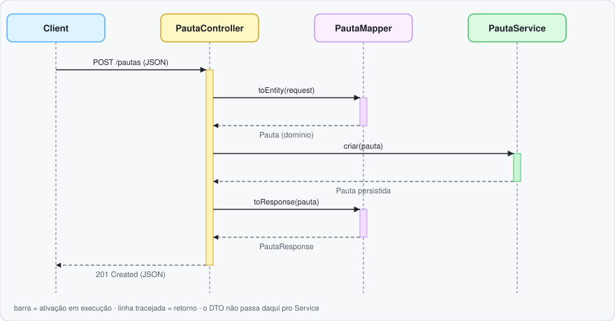
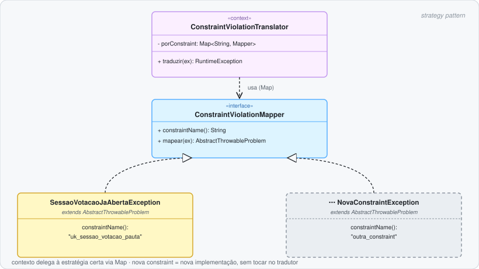
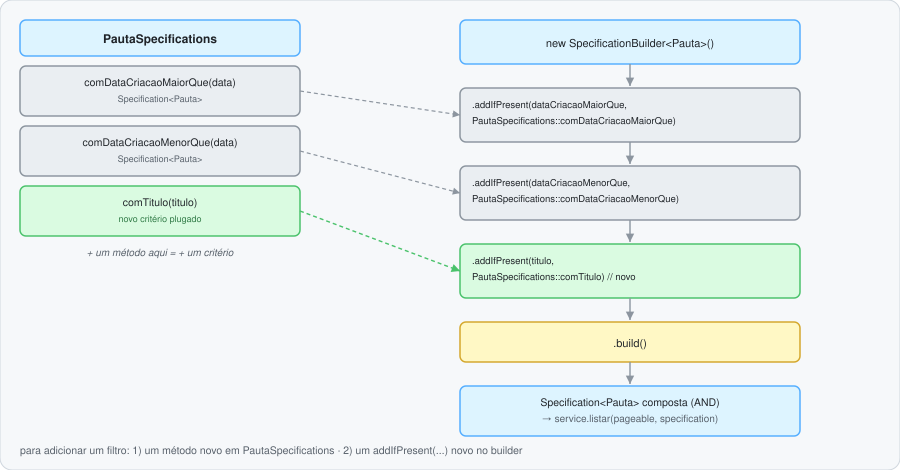

# 🗳️ Cooperative Voting API

API de votação cooperativa — cadastro de pautas, sessões de votação e apuração de resultado.

<p>
  
  
  
  
</p>

## 🚀 Como executar

```bash
docker compose up --build
```

Sobe Postgres + API em `http://localhost:8080`.

Alternativa rodando a API localmente (IDE/debug), só o banco em container:

```bash
docker compose up postgres -d
./mvnw spring-boot:run -Dspring-boot.run.profiles=dev
```

## 📖 Documentação

A spec fica em um arquivo próprio — [openapi.yaml](src/main/resources/static/openapi.yaml) ↗ — em vez de gerada a
partir de anotação em controller. Decisão consciente: mantém o código do controller limpo, sem anotação de
documentação misturada com lógica de negócio, e deixa a descrição dos endpoints (texto, exemplos, formatação)
livre pra ser customizada sem precisar tocar em código Java.

- 🧭 Swagger UI: [http://localhost:8080/api/v1/swagger-ui/index.html](http://localhost:8080/api/v1/swagger-ui/index.html) ↗
- 🌀 Scalar (alternativa ao Swagger, mesma spec): [http://localhost:8080/api/v1/scalar.html](http://localhost:8080/api/v1/scalar.html) ↗
- 📄 Spec crua: [http://localhost:8080/api/v1/openapi.yaml](http://localhost:8080/api/v1/openapi.yaml) ↗

## 🏷️ Versionamento

Cada versão publicada segue [Keep a Changelog](https://keepachangelog.com/pt-BR/1.1.0/) ↗ e
[Semantic Versioning](https://semver.org/lang/pt-BR/) ↗, com uma tag `vX.Y.Z` correspondente no repositório.

- 📝 Changelog: [CHANGELOG.md](CHANGELOG.md) ↗
- 🚀 Releases: [github.com/murillo-tavares/cooperative-voting-api/releases](https://github.com/murillo-tavares/cooperative-voting-api/releases) ↗

## 🧪 Testes

Suíte dividida entre testes unitários e de integração, marcados respectivamente pelas interfaces
[UnitTest](src/test/java/br/com/cooperativevoting/support/suite/UnitTest.java) ↗ (`@Tag("unit")`) e
[IntegrationTest](src/test/java/br/com/cooperativevoting/support/suite/IntegrationTest.java) ↗ (`@Tag("integration")`).
Integração sobe banco real via Testcontainers — precisa Docker rodando.

```bash
./mvnw test  # unitário: rápido, sem infra
```

```bash
./mvnw test -Dsurefire.excludedGroups= -Dsurefire.groups=integration  # integração: banco via Testcontainers (Docker)
```

### 🔥 Carga

[VotoSimulation](src/test/java/br/com/cooperativevoting/loadtest/VotoSimulation.java) ↗ (Gatling) sobe uma pauta,
abre sessão e simula 200 usuários votando concorrentemente. Precisa da API rodando com o profile `loadtest` ativo
(cliente de aptidão fake, sem depender do random.org):

> ⚠️ **A integração com sistema externo (random.org, Tarefa Bônus 1) é o maior gargalo de tempo de resposta do
> fluxo de voto.** Medido diretamente: média de ~387ms por chamada, chegando a ~690ms — contra poucos ms do resto
> da aplicação. Por isso o teste de carga usa um cliente fake no lugar do random.org: sem isso, o resultado mediria
> a latência do random.org, não da aplicação em si.

```bash
SPRING_PROFILES_ACTIVE=loadtest docker compose up -d --build app
./mvnw gatling:test -DbaseUrl=http://localhost:8080/api/v1
```

## 🏗️ Arquitetura

### 🔄 DTOs + MapStruct

Mapeamento entre [DTO](src/main/java/br/com/cooperativevoting/api/dto) ↗ e
[domínio](src/main/java/br/com/cooperativevoting/domain/model) ↗ é gerado em build time pelo
[MapStruct](src/main/java/br/com/cooperativevoting/api/mapper) ↗ — sem código manual de conversão pra escrever ou
manter; atualizar um campo é só mexer na interface do mapper.

No controller, o DTO nunca escapa da camada web: chega como JSON, o mapper converte pra entidade de domínio antes
de chegar no service; na volta, o mapper converte a entidade de volta pra DTO antes de virar JSON de novo.

 Controller -> Mapper -> Service e volta" width="820">

### 🚨 Tratamento de erros

Cada erro de negócio tem sua própria [exception](src/main/java/br/com/cooperativevoting/domain/exception) ↗, com
status, mensagem e código únicos, capturada globalmente pelo
[GlobalExceptionHandler](src/main/java/br/com/cooperativevoting/api/exception/GlobalExceptionHandler.java) ↗ via
Zalando Problem — catálogo autodocumentado e testável pelo código, sem depender de texto de mensagem.

Violação de constraint do banco (ex.: sessão duplicada) segue **strategy + map**: o `INSERT` é otimista — um
`SELECT` prévio não seguraria concorrência —, e se a constraint falhar, o
[ConstraintViolationTranslator](src/main/java/br/com/cooperativevoting/domain/exception/constraint/ConstraintViolationTranslator.java) ↗
busca num `Map<constraintName, Mapper>` qual
[ConstraintViolationMapper](src/main/java/br/com/cooperativevoting/domain/exception/constraint/ConstraintViolationMapper.java) ↗
sabe traduzi-la. Nova constraint = nova implementação, sem tocar no tradutor.



### 🧩 Filtro + Specification

[Filtros](src/main/java/br/com/cooperativevoting/domain/filter) ↗ usam o framework `Specification` do Spring Data
em vez de query fixa: cada campo filtrável é um critério isolado e reaproveitável em `PautaSpecifications`, e o
`SpecificationBuilder` combina só os critérios presentes na requisição num único `AND`. Estender é fácil — um
filtro novo é só mais um critério, sem afetar os existentes nem exigir um método por combinação.

Adicionar um filtro é sempre três passos: um campo no record, um método novo em `PautaSpecifications` e um
`.addIfPresent(...)` novo em `toSpecification()` — nada existente muda.



### 🪪 Entidade

#### `data_exclusao` — exclusão lógica

Exclusão é lógica: um `UPDATE` que marca `data_exclusao`, não um `DELETE`. Mantém histórico pra auditoria e
permite recuperação.
